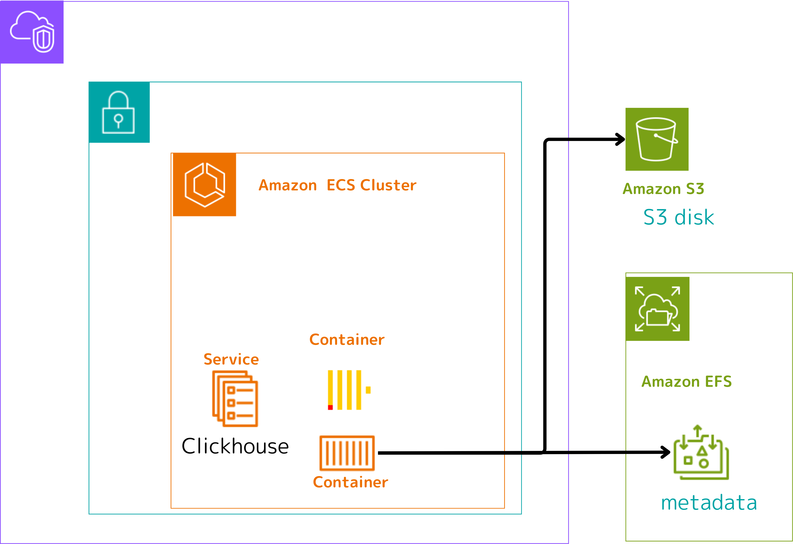

# clickhouse-server-s3disk

## Background

With the update to Langfuse v3, we need to run Clickhouse on AWS ECS Fargate. 

Please refer to the following Terraform for the implementation details.

<https://github.com/tubone24/langfuse-v3-terraform>

While we initially created and mounted EFS for Clickhouse data persistence on ECS Fargate, we discovered that EFS is approximately 300% more expensive compared to EBS.

Since our Langfuse Clickhouse implementation doesn't require high-speed data access, we determined that block storage like EFS is unnecessary. Instead, we aim to achieve cost-effective data persistence by using S3 as a backend storage solution and storing most of the data there.

## Approach
Clickhouse provides mechanisms called S3 Disk and Storage Policy. These features allow us to:

- Use S3 as a virtual disk for Clickhouse
- Configure data storage according to policies that specify which disk to use for different types of data

By applying these policies to the MergeTree engine used in Langfuse, we can store data in S3.

However, it's important to note that S3Disk requires separate block storage for storing metadata. We achieve complete persistence by using EFS for this metadata storage.



## Local Execution with MinIO

Before deploying to AWS, you can verify this functionality locally using MinIO as an S3-compatible storage solution.

```bash
docker compose -f docker-compose-local.yml up
```

## Usage

### Create S3 and EFS

First, create an ECS cluster to run Clickhouse. 

Create an EFS for metadata storage and mount it in the ECS task definition. Additionally, create an S3 bucket for S3Disk storage.

### Build Docker Image

Create a Docker image using clickhouse-server as the base image. Push this image to your pre-configured ECR repository.

```bash
docker buildx build --platform=linux/arm64 -t clickhouse-server-s3:latest --load .
```

### Configure Task Definition Environment Variables

Add the S3 region and bucket name to the Clickhouse task definition as follows:

```json
{
  "containerDefinitions": [
    {
      "name": "clickhouse",
      "environment": [
        {
          "name": "AWS_REGION",
          "value": "ap-northeast-1"
        },
        {
          "name": "S3_BUCKET",
          "value": "your-bucket-name"
        }
      ]
    }
  ]
}
```

## Special Thanks

I would like to express my sincere gratitude to [@Steffen911](https://github.com/Steffen911) who provided invaluable guidance through [the Langfuse Discussion](https://github.com/orgs/langfuse/discussions/5516) forum, helping us arrive at this Clickhouse implementation solution.

His assistance was instrumental in reaching this point.

This journey to optimize our Clickhouse configuration would not have been possible without his expert advice and support through the discussion process.

Thank you again for your help and contribution to making this improvement possible.